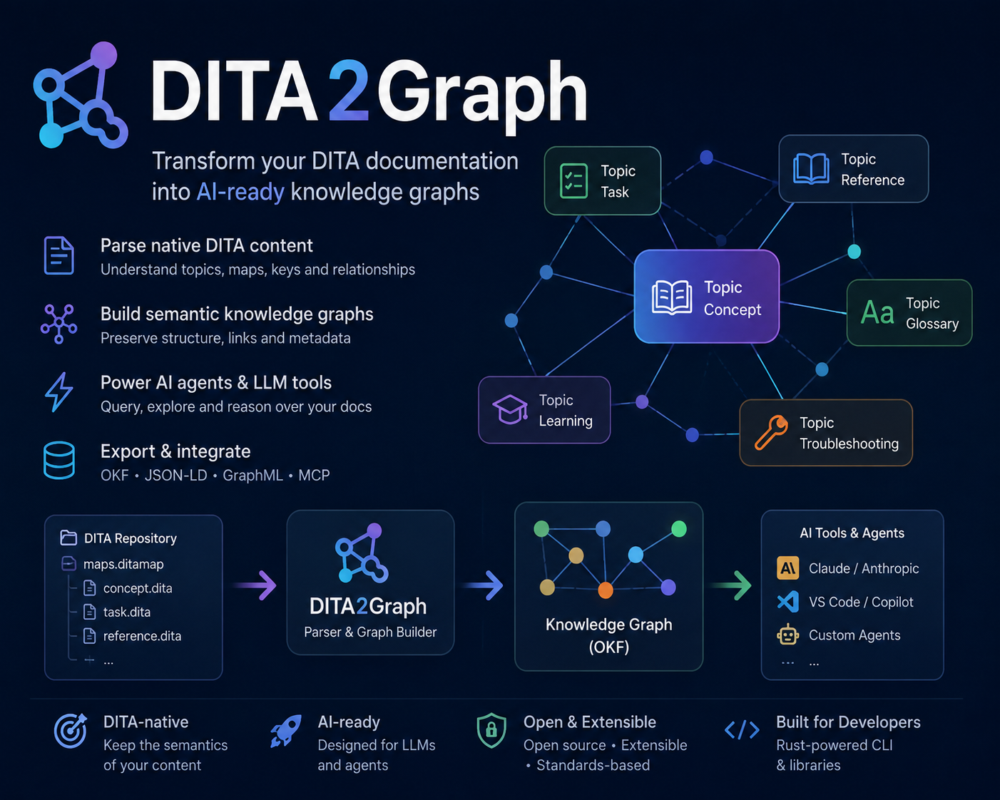
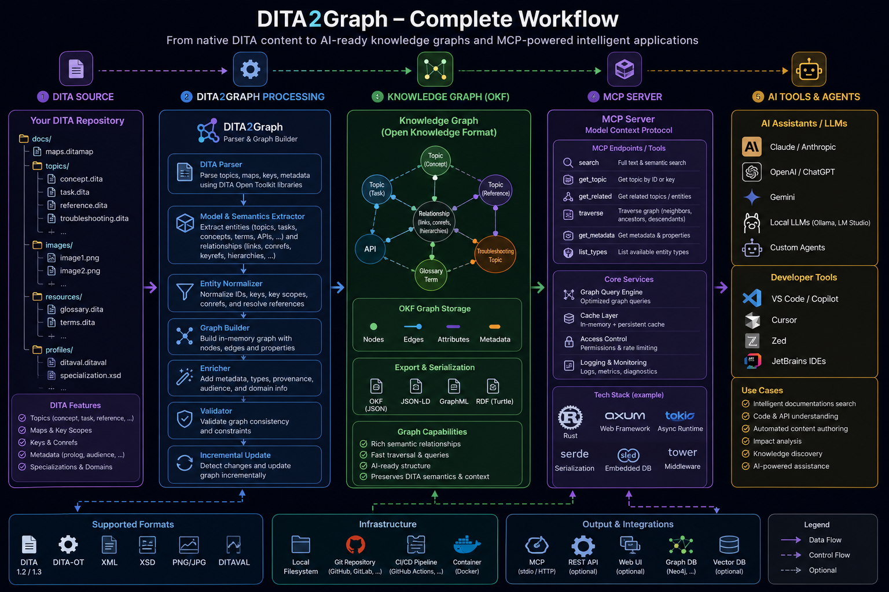
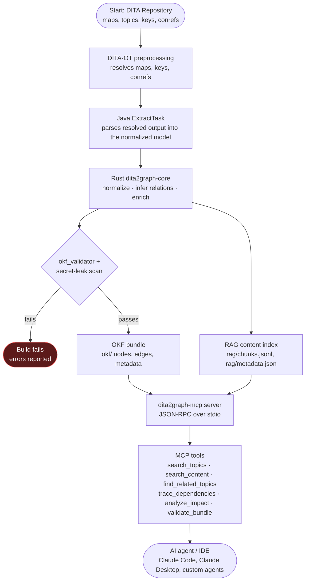

# DITA2Graph



A DITA-OT plugin that converts DITA content into a semantic knowledge
graph (using [OKF](https://github.com/GoogleCloudPlatform/knowledge-catalog/blob/main/okf/SPEC.md)
v0.2 as the representation) and exposes it to AI agents over MCP.

Full design and rationale: **[`docs/plugin-specification.md`](docs/plugin-specification.md)**.
Phase-by-phase status and what's next: **[`Roadmap.md`](Roadmap.md)**.
The evidence behind that status — what was actually tested against a
live DITA-OT 4.4, what broke, and how it was fixed:
**[`docs/dev/phase-0-findings.md`](docs/dev/phase-0-findings.md)**.
Component, class, activity, and sequence diagrams of the system:
**[`docs/architecture.md`](docs/architecture.md)**.
A complete install-to-query walkthrough, on both the bundled sample
project and your own existing DITA project:
**[`docs/tutorial.md`](docs/tutorial.md)**.

## Status

The core pipeline is real and runs end to end: DITA-OT preprocessing →
Java extraction → Rust OKF writer → validated bundle → MCP server.

| Component | Status |
|---|---|
| `docs/plugin-specification.md` | Design spec, complete |
| `core/dita2graph-core` (Rust) | Working: normalized-model types, OKF bundle writer, `related-to`/`applies-to` relation inference (`relations.rs`, findings 13 and 15 — an ambiguous `applies-to` match is dropped and logged, not guessed), RAG content index writer (`rag/`, §13.1), `build`/`validate`/`query` CLI, passing tests |
| `mcp/dita2graph-mcp` (Rust) | Working: JSON-RPC-over-stdio MCP server with the full §5.2 tool set, passing tests; takes a bundle root directly or via `--config <mcp-server.toml>` (written by `dita2graph-core build --mcp true`, §5.4). §5.1's Resources (`resources/list`/`resources/read`) are not implemented |
| `plugin/org.dita.dita2graph/java` (Java) | Working: `ExtractTask` parses DITA-OT's resolved output into the normalized model, shells out to `dita2graph-core`; unit tested. Walks nested `topicref`/`topichead`/`topicgroup` map structures at any depth, not just the top level, excludes DITA-OT's auto-generated `related-links` navigation from cross-reference extraction, and enforces `args.dita2graph.depth` to limit how many containment levels are captured (`docs/dev/phase-0-findings.md` finding 11). `mapref`/`anchorref` submap composition works with zero extra code — DITA-OT's own preprocessing flattens it into the same map tree (finding 14). Also extracts `uicontrols`/`cmdUicontrols` (for `applies-to`) and derives `generated-from` edges directly from DITA-OT's own `xtrf` source-trace attributes — a `conref`/`conkeyref`-pulled element inherits its true source's `xtrf`, distinguishing real reuse from ordinary `keyref` variable substitution (finding 15). `<navref>` (not resolved by DITA-OT for this transtype) is detected and logged (`DITA2GRAPH060W`) instead of silently dropped (finding 16) |
| `plugin/org.dita.dita2graph` (Ant/XML) | **Verified end-to-end** against a live DITA-OT 4.4: installs, dispatches, produces a real `okf_validator`-passing bundle, and accepts `--args.dita2graph.*` CLI overrides (all five, via `plugin.xml`'s `<param>` declarations — previously silently rejected by DITA-OT's own CLI parser, see `docs/dev/phase-0-findings.md` finding 10) |
| `gradle-build/` | Real Gradle 9.6.1 + Kotlin DSL project; `./gradlew buildKnowledgeGraph` runs the entire pipeline for real, plus `buildKnowledgeGraphPublic`/`buildKnowledgeGraphInternal` for the DITAVAL split (§6.1) and `buildKnowledgeGraphNested`/`buildKnowledgeGraphMapref`/`buildKnowledgeGraphRelations` for map-structure and relation-inference fixtures |
| `sample-docs/` | A small fixture DITA project, confirmed to resolve correctly and extract correctly through the full pipeline, including one `audience="internal"` topic used to prove the DITAVAL split actually filters |
| `sample-docs-nested/` | A fixture exercising nested `topicref`/`topichead`/`topicgroup` and the `related-links` exclusion (finding 11) |
| `sample-docs-mapref/` | A fixture exercising `mapref`/`anchorref` submap composition (finding 14) and `<navref>` detection (finding 16) |
| `sample-docs-relations/` | A fixture exercising `applies-to` (unambiguous match + ambiguous-drop) and `generated-from` (`conref` reuse) (finding 15) |
| CI | Real: `rust.yml`/`java.yml` unit-test each side, `integration.yml` runs the full pipeline (including the DITAVAL split, the nested-map/mapref/anchorref/relation-inference fixtures, and the broken-input negative test) against a live DITA-OT 4.4 |
| Security (§6) | Secret-leakage detection shipped (`core/dita2graph-core/src/secrets.rs`, build-breaking, §6.4, covers `okf/` and `rag/`); public/internal DITAVAL split demonstrated (§6.1); HTTP transport auth (§6.3) not yet implemented — stdio only |
| Licensing | Decided and shipped: dual **MIT OR Apache-2.0** across the whole repo (`LICENSE`, `NOTICE`) |
| Hybrid graph+RAG architecture (§13.1) | Nearly done: body-text extraction, `rag/chunks.jsonl` + `rag/metadata.json` (same single pass as `okf/`), `search_content` (graph-narrowed, keyword-frequency-ranked content search), and `analyze_impact` (reverse, transitive graph traversal with a text excerpt per affected concept). Still design-only: node-level embeddings (the heavier, not-yet-committed direction) |

See `docs/dev/phase-0-findings.md` for what's still narrower than the
full spec envisions: full `<navref>` map composition (`mapref`/
`anchorref` are done, finding 14; `<navref>` is detected and warned
about rather than silently dropped, finding 16, but real support would
mean this plugin independently parsing/merging navigation maps outside
DITA-OT's own pipeline — not attempted), canonical-node deduplication
for `conref`/`conkeyref`-reused content (`generated-from` tracks
provenance but doesn't collapse storage, finding 15), and §5.1's MCP
Resources — `dita://topics` etc. — which `dita2graph-mcp` doesn't
implement at all, only the §5.2 tools — real gaps, documented rather
than hidden. Every relation in §4.3's taxonomy (`contains`/`requires`/
`references`/`applies-to`/`related-to`/`generated-from`) is now real
(findings 13, 15), and all five `args.dita2graph.*` parameters,
including `mcp`, are functionally wired end to end (finding 12).

**Release status:** the MVP scope (§11) is functionally complete;
`v0.1.0` is tagged — see **[`Roadmap.md`](Roadmap.md)** for the
phase-by-phase breakdown and what's left for Phase 6+. Future releases
are automated: run the **Tag release** workflow from the Actions tab
(`workflow_dispatch`, takes a version number) to tag, which triggers
**Release** to test, build, and publish a GitHub Release with the Rust
binaries and the DITA-OT plugin zip attached.

## Workflow

From native DITA content to AI-ready knowledge graphs and MCP-powered
intelligent applications:



### Conversion pipeline (UML activity diagram)



For the system's component boundaries, the Rust type architecture, the
parsing/graph-generation/incremental-update workflows, and an MCP
request/response walkthrough, see
**[`docs/architecture.md`](docs/architecture.md)**.

## Use cases with AI tools (Claude Code)

Once `dita2graph-mcp` is registered with an MCP-capable client (see
[Quickstart](#quickstart-what-works-today)), these are the most useful
ways to put it to work:

### 1. Impact analysis before touching a doc set

`analyze_impact(topicId)` runs a reverse, transitive graph traversal —
"everything that depends on this topic" — with a text excerpt per
affected concept. Ask Claude Code "what breaks if I deprecate the
`authentication` concept?" and it gets a deterministic answer from real
`requires`/`applies-to` edges instead of a guess. This is the standout
case because it's something plain-text RAG can't do at all — there's no
dependency graph in a vector index (§9.1 of the spec).

### 2. Grounded documentation Q&A that doesn't hallucinate

`search_content` is graph-narrowed and keyword-ranked over the actual
`rag/` text, and can be scoped to a topic's neighborhood
(`topicId`/`relation`/`depth`). Chained with `find_related_topics`, an
agent answering "how do I configure X?" gets a typed traversal (task →
requires → concept/reference) with citable topic IDs, instead of
best-effort nearest-neighbor chunks that may mash together unrelated
sections.

### 3. Fast doc-set orientation for an agent dropped into an unfamiliar corpus

`search_topics` → `explain_task` → `generate_summary` lets an agent map
a large DITA project in a handful of cheap, typed calls — on the order
of tens of tokens each (§9.2) — instead of reading raw resolved
XML/HTML output or grepping the repo. Useful for onboarding an agent
(or a new writer) into a doc set it hasn't seen before.

## Use cases for technical writers

The graph isn't only for AI agents acting on their own — it's just as
useful queried by a writer (directly, or through Claude Code as an
authoring assistant) during content maintenance and pre-publish review:

### 1. Content reuse and provenance auditing

`generated-from` edges are derived straight from DITA-OT's own `xtrf`
source-trace attributes, so they distinguish a real `conref`/`conkeyref`
reuse from an ordinary `keyref` variable substitution. Before editing a
topic that looks like reused content, a writer can confirm whether
they're looking at the canonical source or a pulled-in copy — editing
the wrong one is a classic way DITA content sets drift out of sync.
(Note: the graph tracks this provenance today but doesn't yet collapse
duplicate storage into one canonical node — that's an open Phase 6+ item,
see `docs/dev/canonical-node-dedup-spec.md`.)

### 2. Safe restructuring — what references this before you rename, merge, or delete it

The same `analyze_impact`/`find_related_topics`/`trace_dependencies`
tools used for code-impact analysis answer a writer's version of the
same question: "if I merge these two topics" or "if I retire this
concept, what else in the doc set points to it?" — a deterministic
answer from declared `requires`/`references`/`related-to` edges instead
of manually grepping cross-references across the map.

### 3. Pre-publish review — audience/product scoping and structural QA

The DITAVAL-driven public/internal bundle split (§6.1) lets a writer
build and inspect exactly what a given audience or product variant of
the docs will actually contain before it ships — catching content that
leaked across a filtering boundary it shouldn't have. `validate_bundle()`
complements this by re-running `okf-validator` and the secret-leak scan
on demand, catching broken cross-references or accidentally-committed
secrets in the same pre-publish pass.

## Toolchain requirements

Per `docs/plugin-specification.md` §1.1: **Gradle 9.0 minimum**, **Java 25
(latest LTS)**, **Rust latest stable** (currently 1.97.1, pinned in
`rust-toolchain.toml` — `rustup` picks it up automatically). `.java-version`
at the repo root pins the Java requirement for tooling that reads it.
`plugin/org.dita.dita2graph/java` currently compiles at `--release 21`
(no JDK 25 available where this was built/tested — see that
subproject's README).

## Quickstart (what works today)

For the terse version, keep reading. For a full walkthrough — including
installing the plugin on your own existing DITA project and a worked
set of example questions to ask over MCP — see
**[`docs/tutorial.md`](docs/tutorial.md)**.

```bash
# Build the Rust workspace (rustup fetches the pinned toolchain automatically)
cargo build --release --workspace

# Build the DITA-OT plugin's Java side
(cd plugin/org.dita.dita2graph/java && ./gradlew jar)

# Install the plugin and run it against the sample project, via the real
# Gradle/Kotlin DSL harness. First run downloads DITA-OT 4.4 (~50MB
# compressed, ~80MB installed) into gradle-build/build/dita-ot/ -- give
# it a minute the first time; later runs reuse the cached install.
export DITA2GRAPH_CORE_BIN="$PWD/target/release/dita2graph-core"
(cd gradle-build && ./gradlew buildKnowledgeGraph)

# Inspect the real, generated, validated bundle
cat gradle-build/build/dita2graph/okf/topics/installing-product.md
./target/release/dita2graph-core validate --bundle gradle-build/build/dita2graph/okf

# Inspect the RAG content index written alongside it, from the same
# extraction pass (§13.1) -- search_content/analyze_impact below read this
cat gradle-build/build/dita2graph/rag/chunks.jsonl

# Talk to the MCP server directly over stdio (one JSON-RPC message per line)
echo '{"jsonrpc":"2.0","id":1,"method":"tools/call","params":{"name":"search_topics","arguments":{"query":"install"}}}' \
  | ./target/release/dita2graph-mcp gradle-build/build/dita2graph

# Content search (searches rag/'s actual text, ranked by keyword frequency --
# not just titles/ids the way search_topics is)
echo '{"jsonrpc":"2.0","id":1,"method":"tools/call","params":{"name":"search_content","arguments":{"query":"install product"}}}' \
  | ./target/release/dita2graph-mcp gradle-build/build/dita2graph

# Impact analysis: what depends on this topic, transitively, with a text
# excerpt of each affected concept
echo '{"jsonrpc":"2.0","id":1,"method":"tools/call","params":{"name":"analyze_impact","arguments":{"topicId":"configuration"}}}' \
  | ./target/release/dita2graph-mcp gradle-build/build/dita2graph
```

To register the server with Claude Code once you have a bundle built:

```bash
claude mcp add dita2graph -- ./target/release/dita2graph-mcp gradle-build/build/dita2graph
```

### Available MCP tools

Once registered, an agent can call:

| Tool | What it does |
|---|---|
| `search_topics(query)` | Plain text match against topic/map titles and ids |
| `search_content(query, topicId?, relation?, depth?)` | Ranked full-text search over `rag/` content, each hit with a text excerpt; scope it to a topic's graph neighborhood for hybrid graph+content queries (§13.1) |
| `find_related_topics(topicId, relation?)` | Direct relations from a topic |
| `explain_task(topicId)` | Title, description, a body excerpt, and key relations for a topic |
| `trace_dependencies(topicId, depth?)` | Forward `requires` chain from a topic |
| `analyze_impact(topicId, depth?)` | Reverse, transitive traversal — everything that would be affected by changing this topic, with content excerpts (§13.1) |
| `generate_summary(topicId)` | Title + description for a topic or map |
| `validate_bundle()` | Re-runs `okf-validator` + the secret-leak scan on demand |

Full argument shapes and behavior: `docs/plugin-specification.md` §5.2.

### Using your own DITA project

The `gradle-build/` harness above is a demo pointed at this repo's own
`sample-docs/`, not a template to copy into your own project. To run
against your own DITA content instead, install the plugin into your own
DITA-OT and invoke it directly — see `docs/plugin-specification.md` §15
(Appendix A: Quickstart) for the full sequence (`dita --install`, then
`dita --format dita2graph`).

## Repository layout

```
Roadmap.md                      # phase-by-phase status and what's next
docs/plugin-specification.md    # design spec, source of truth
docs/architecture.md            # component/class/activity/sequence diagrams
docs/dev/phase-0-findings.md    # spike results and decisions made from them
core/dita2graph-core/           # Rust: normalized model, OKF writer, CLI (§3)
mcp/dita2graph-mcp/             # Rust: MCP server (§5)
plugin/org.dita.dita2graph/     # DITA-OT plugin: plugin.xml/build.xml/cfg (§2)
plugin/org.dita.dita2graph/java # Java: ExtractTask, builds lib/dita2graph-core.jar
gradle-build/                   # Live Gradle/Kotlin DSL integration harness (§8)
sample-docs/                    # fixture DITA project used by tests/demos
sample-docs-nested/             # fixture: nested topicref/topichead/topicgroup (finding 11)
sample-docs-mapref/             # fixture: mapref/anchorref/navref map composition (findings 14, 16)
sample-docs-relations/          # fixture: applies-to/generated-from relation inference (finding 15)
```
