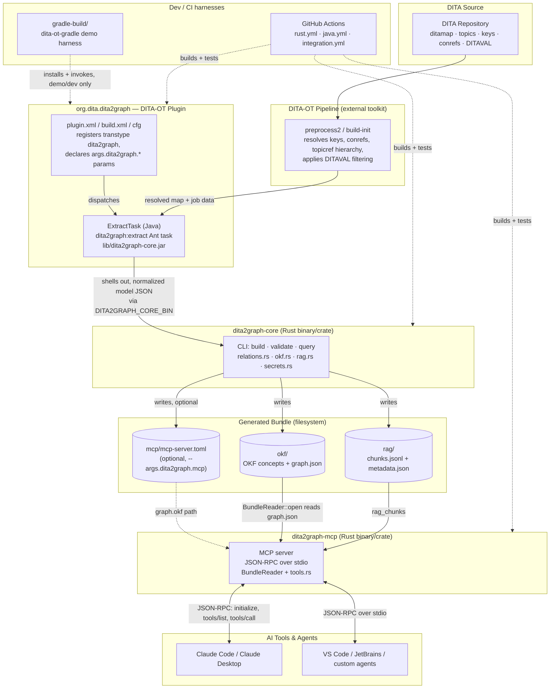
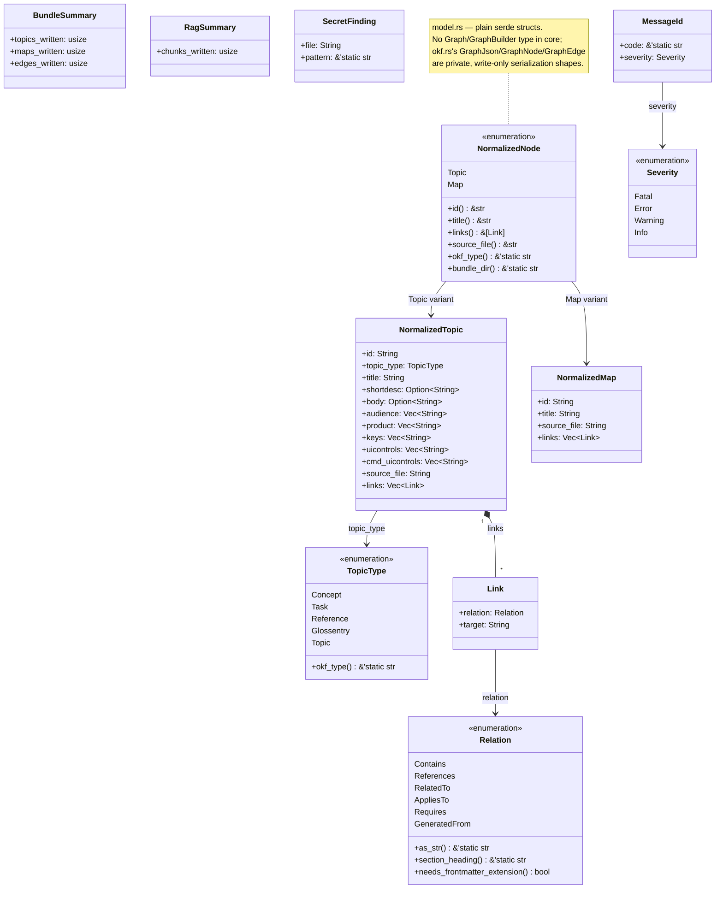
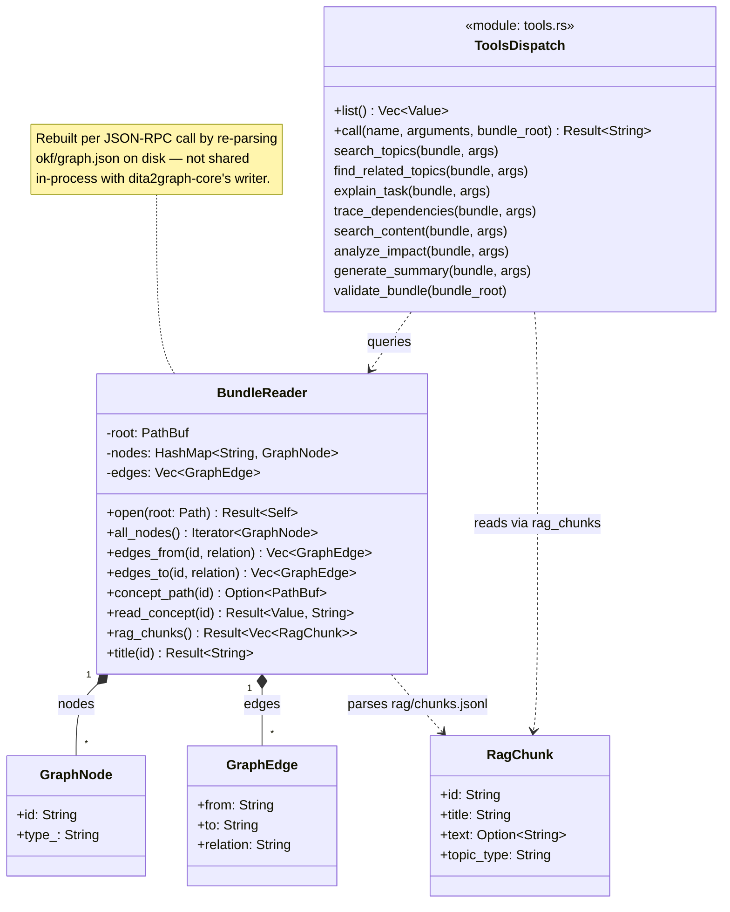
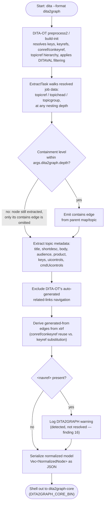
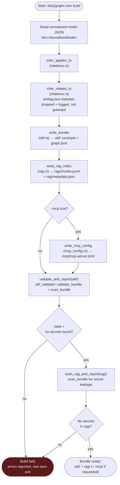
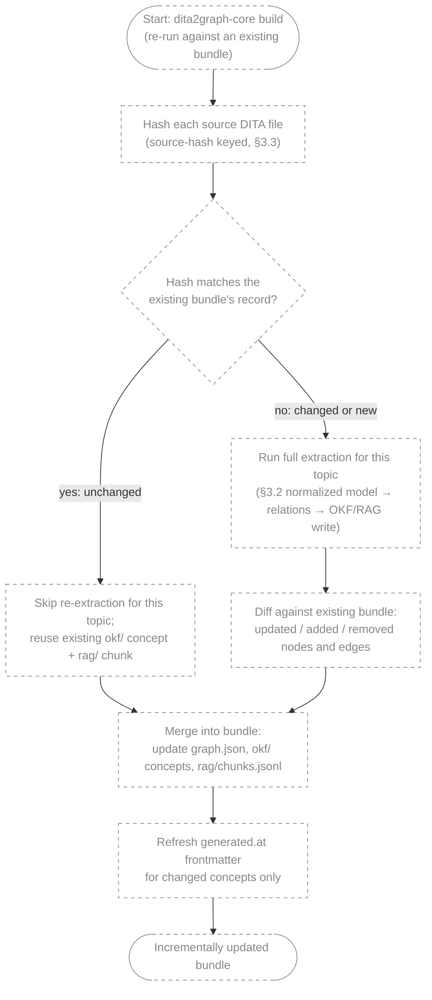
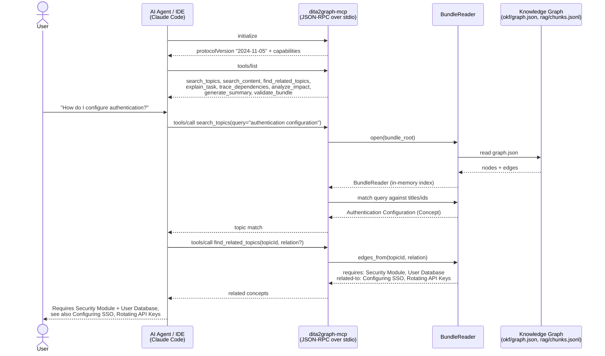

# Architecture & Diagrams

This document collects the UML-style diagrams for DITA2Graph, each
using the diagram type best suited to what it's showing:

- **[Component diagram](#component-diagram--system-architecture)** — the
  overall system architecture: how the DITA-OT plugin, the Rust core
  engine, the generated bundle, the MCP server, and AI agents fit
  together as deployable pieces.
- **[Class diagrams](#class-diagrams--rust-architecture)** — the Rust
  type architecture: the normalized model in `core/dita2graph-core`
  and the in-memory bundle index in `mcp/dita2graph-mcp`.
- **[Activity diagrams](#activity-diagrams--internal-processing-workflows)**
  — internal processing workflows: DITA parsing/extraction, OKF/RAG
  graph generation, and the (planned, not yet implemented) incremental
  update flow.
- **[Sequence diagram](#sequence-diagram--ai-agent--mcp-server--knowledge-graph)**
  — a concrete interaction between an AI agent, the MCP server, and the
  knowledge graph on disk.

All diagrams are Mermaid and render natively in GitHub. They're kept
here, separate from the top-level `README.md`'s flowchart, because
they go one level deeper — into module boundaries, types, and method
signatures — which belongs in developer documentation rather than the
project's front page. Every diagram is derived directly from the code
(`core/dita2graph-core/src/`, `mcp/dita2graph-mcp/src/`) and the design
spec (`docs/plugin-specification.md`), not from an idealized version of
either; where a diagram shows something not yet implemented, it says so
explicitly, in keeping with this repo's `README.md`/`Roadmap.md`
practice of documenting real gaps rather than hiding them.

## Component diagram — system architecture

How the pieces are deployed and what crosses which boundary: the DITA
repository feeds DITA-OT, DITA-OT dispatches to the `org.dita.dita2graph`
plugin, the plugin's Java `ExtractTask` shells out to the Rust
`dita2graph-core` binary, which writes the OKF bundle and RAG index to
the filesystem, which `dita2graph-mcp` reads back and serves to AI
agents over JSON-RPC. `gradle-build/` and CI are dev/build-time
harnesses, not part of the runtime path.

## Class diagrams — Rust architecture

### `core/dita2graph-core` — normalized model

`model.rs` is plain serde structs and enums — there is **no**
`Graph`/`GraphBuilder` type in the core crate. `okf.rs`'s
`GraphJson`/`GraphNode`/`GraphEdge` types (used to serialize
`graph.json`) are private and write-only, not exported from the crate
and not a queryable in-memory graph.

`BundleSummary`, `RagSummary`, and `SecretFinding` are return values of
`write_bundle`, `write_rag_index`, and `scan_bundle` respectively — they
aren't referenced by the model types above, which is why they're
unconnected in the diagram. `MessageId`/`Severity` (`diagnostics.rs`)
back the `DITA2GRAPHnnnX` message catalog used for build diagnostics.

### `mcp/dita2graph-mcp` — bundle reader and tool dispatch

`BundleReader` is **not** shared in-process with `dita2graph-core`'s
writer — it's rebuilt on demand by re-parsing `okf/graph.json` off
disk each time the MCP server opens a bundle.

## Activity diagrams — internal processing workflows

### Parsing / extraction (`ExtractTask`, Java)

What happens between DITA-OT resolving a map and the normalized model
being handed off to the Rust core — including `args.dita2graph.depth`
enforcement, `related-links` exclusion, `xtrf`-derived `generated-from`
provenance, and `<navref>` detection (`docs/dev/phase-0-findings.md`
findings 11, 14, 15, 16).

### Graph generation (`dita2graph-core build`, Rust)

The `run_build` flow in `core/dita2graph-core/src/main.rs`: relation
inference, bundle writing, optional MCP config, and the two validation
gates (`okf_validator` + secret-leak scan) that make a failed build
fail loudly instead of shipping a bad bundle.

### Incremental update (planned — not yet implemented)

**This is a design diagram, not a working feature.** Source-hash-keyed
incremental rebuild is listed as future work in
`docs/plugin-specification.md` §3.3 and `Roadmap.md`'s Phase 6+ —
today, every `dita2graph-core build` re-extracts and rewrites the whole
bundle. The dashed styling below marks every step as not yet
implemented.

## Sequence diagram — AI agent ↔ MCP server ↔ knowledge graph

A concrete walk through `docs/plugin-specification.md` §5.3's example
interaction, down to the actual JSON-RPC methods `dita2graph-mcp`
implements (`initialize`, `tools/list`, `tools/call`) and the
`BundleReader` calls each tool makes (`mcp/dita2graph-mcp/src/tools.rs`).

